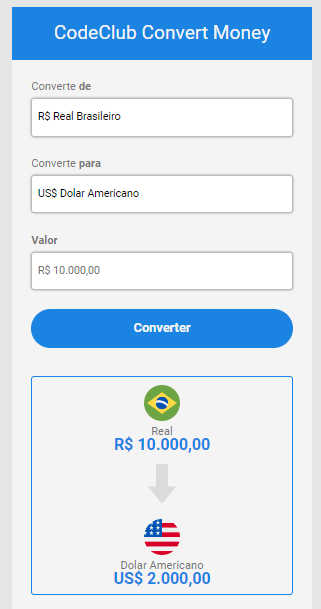

# Conversor de Moedas

Acesse á página clicando <a href="https://ciceronunes.github.io/ConversordeMoedas/">Aqui</a>

>Tela de conversão

## 😄 O que é o projeto?
Este projeto foi desenvolvido no comunidade DevClub.

A função do mesmo é converter de Real para ( Bitcoin, Dolar ou Euro) conforme mudamos a moeda "destino" e façamos a conversão.

## O que Usamos, Ajustes e melhorias

O que poderemos mudar/melhorar.

- [x] CSS 
    Implementar um "botão" para quando clicado alterar a cor de fundo.
- [x] Consumo de API 
    O sistema ainda não está buscando o valor atual da moeda selecionada para fazer a conversão.
    

## 🤝 Colaboradores

Agradecemos às seguintes pessoas que contribuíram para este projeto:

<table>
  <tr>
    <td align="center">
      <a href="#">
         
         
          <b>Cicero Alves</b>
        
      </a>
</table>
